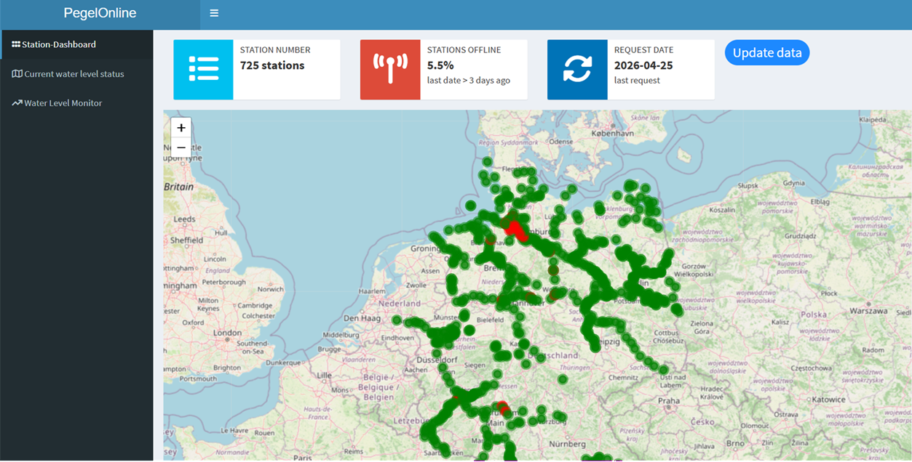
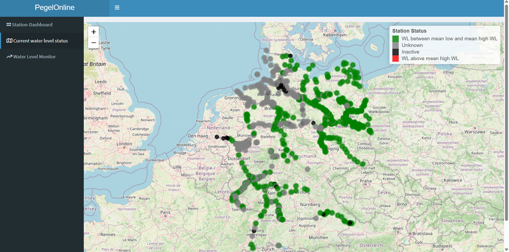
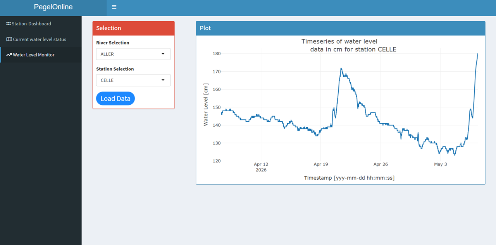

<!-- README.md is generated from README.Rmd. Please edit that file -->

```{r, include = FALSE}
  knitr::opts_chunk$set(
    collapse = TRUE,
    comment = "#>",
    fig.path = "man/figures/README-",
    out.width = "100%"
)
```

# `{dispPO}`

dispPO is an R package for fetching, processing, and visualizing water level measurements from the PegelOnline API. It provides tools to cache data, calculate station status, generate Leaflet maps, and integrate with Shiny dashboards.

## Features
* Fetch current and historical water level data for German river stations
* Cache data locally for faster subsequent queries
* Calculate station statistics, including latest water level and online/offline status
* Color-coded markers for Leaflet maps (green, red, grey) based on station status
* Functions compatible with Shiny apps for live dashboards

## Installation

You can install the development version of `{dispPO}` like so:

```{r,eval = FALSE}
# install.packages("devtools") if not already installed
# devtools::install_github("felixodh/dispPO")
```

## Get started

You can launch the application by running:

```{r, eval = FALSE}
# dispPO::run_app()
```

It first checks if the necessary folders and files exist and if not it creates them. It loads and displays the data available since the last download.  

## App preview







## About

Data source: PegelOnline (WSV, Germany)
https://www.pegelonline.wsv.de

You are reading the doc about version : `r golem::pkg_version()`

This README has been compiled on the

```{r}
Sys.time()
```


```{r echo = FALSE}
unloadNamespace("dispPO")
```


