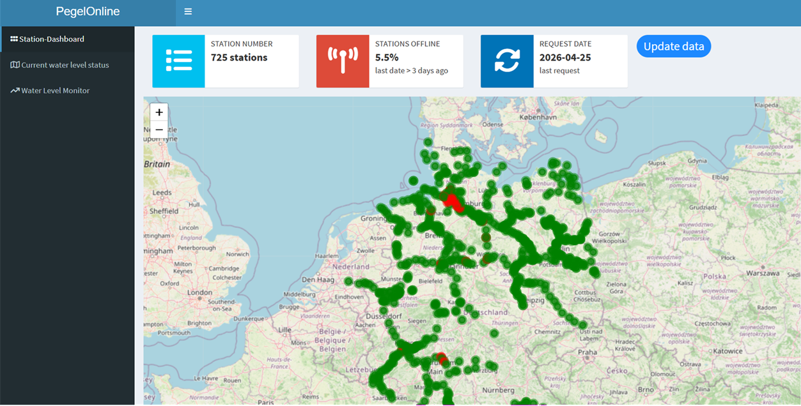
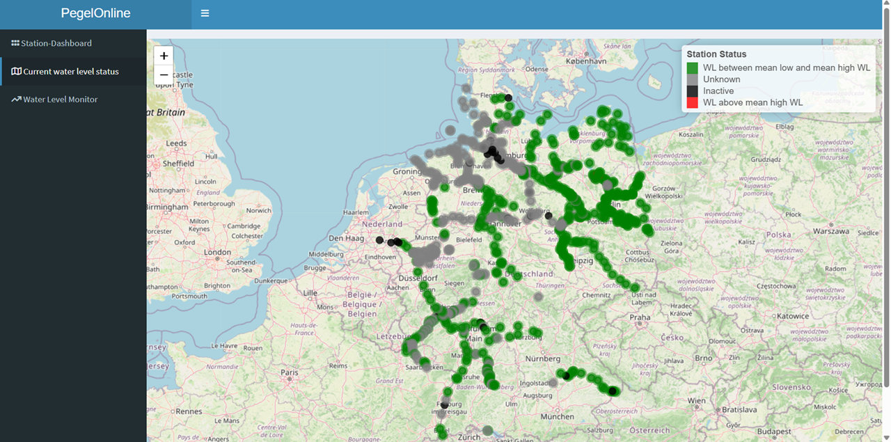

<!-- README.md is generated from README.Rmd. Please edit that file -->

# `{dispPO}`

dispPO is an R package for fetching, processing, and visualizing water
level measurements from the PegelOnline API. It provides tools to cache
data, calculate station status, generate Leaflet maps, and integrate
with Shiny dashboards.

## Features

- Fetch current and historical water level data for German river
  stations
- Cache data locally for faster subsequent queries
- Calculate station statistics, including latest water level and
  online/offline status
- Color-coded markers for Leaflet maps (green, red, grey) based on
  station status
- Functions compatible with Shiny apps for live dashboards

## Installation

You can install the development version of `{dispPO}` like so:

``` r
# install.packages("devtools") if not already installed
# devtools::install_github("felixodh/dispPO")
```

## Get started

You can launch the application by running:

``` r
# dispPO::run_app()
```

It first checks if the necessary folders and files exist and if not it
creates them. It loads and displays the data available since the last
download.

## App preview





## About

You are reading the doc about version : 0.0.0.9000

This README has been compiled on the

``` r
Sys.time()
#> [1] "2026-03-24 10:15:09 CET"
```

Here are the tests results and package coverage:

``` r
devtools::check(quiet = TRUE)
#> ℹ Loading dispPO
#> ── R CMD check results ────────────────────────────────── dispPO 0.0.0.9000 ────
#> Duration: 2m 3.1s
#> 
#> ❯ checking code files for non-ASCII characters ... WARNING
#>   Found the following file with non-ASCII characters:
#>     R/fct_fetch_po_data.R
#>   Portable packages must use only ASCII characters in their R code and
#>   NAMESPACE directives, except perhaps in comments.
#>   Use \uxxxx escapes for other characters.
#>   Function 'tools::showNonASCIIfile' can help in finding non-ASCII
#>   characters in files.
#> 
#> ❯ checking for future file timestamps ... NOTE
#>   unable to verify current time
#> 
#> ❯ checking top-level files ... NOTE
#>   Non-standard file/directory found at top level:
#>     'rsconnect'
#> 
#> ❯ checking R code for possible problems ... [11s] NOTE
#>   fetch_po_data: no visible binding for global variable 'timestamp'
#>   fetch_po_data: no visible binding for global variable 'value'
#>   percent_online: no visible binding for global variable 'flag'
#>   stat_calc_stations: no visible binding for global variable 'uuid'
#>   stat_calc_stations: no visible binding for global variable 'timestamp'
#>   stat_calc_stations: no visible binding for global variable 'wl_cm'
#>   stat_calc_stations: no visible binding for global variable 'shortname'
#>   stat_calc_stations: no visible binding for global variable 'longname'
#>   stat_calc_stations: no visible binding for global variable 'lst_wl'
#>   stat_calc_stations: no visible binding for global variable
#>     'lst_wl_date'
#>   Undefined global functions or variables:
#>     flag longname lst_wl lst_wl_date shortname timestamp uuid value wl_cm
#>   Consider adding
#>     importFrom("utils", "timestamp")
#>   to your NAMESPACE file.
#> 
#> 0 errors ✔ | 1 warning ✖ | 3 notes ✖
#> Error:
#> ! R CMD check found WARNINGs
```

``` r
covr::package_coverage()
#> dispPO Coverage: 23.99%
#> R/app_config.R: 0.00%
#> R/app_server.R: 0.00%
#> R/app_ui.R: 0.00%
#> R/fct_data_processing.R: 0.00%
#> R/fct_fetch_po_data.R: 0.00%
#> R/run_app.R: 0.00%
#> R/zzz.R: 0.00%
#> R/fct_path_manager.R: 28.57%
#> R/mod_current_state.R: 37.21%
#> R/mod_station_dashboard.R: 49.09%
#> R/utils_helpers.R: 89.19%
```
